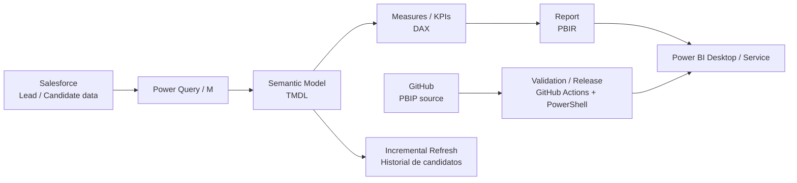

# PanelLeadsIndo — Lead Intelligence Dashboard

Proyecto Power BI de **Universidad Indoamérica** para análisis ejecutivo y operativo del ciclo de Leads, construido como **PBIP (Power BI Project)** y versionado como código mediante **PBIR + TMDL + DAX**.

> **Baseline funcional:** S20.1. El modelo y el diseño aprobados se consideran baseline controlada. Las modificaciones posteriores deben realizarse mediante PR y validación del paquete PBIP.

## 1. Objetivo

El proyecto transforma el reporte original `pnl_Leads_MKT.pbix` en una solución mantenible y auditable para responder, entre otras, estas preguntas:

- ¿Cuántos Leads ingresan y cuántos se gestionan?
- ¿Qué porcentaje llega a **Cita efectiva**?
- ¿Dónde se concentran las pérdidas, inactividad y backlog?
- ¿Qué campañas, sedes, modalidades y carreras muestran mejor desempeño?
- ¿Dónde existe oportunidad comercial o problema de calidad de datos?
- ¿Cómo consultar el detalle operativo de un Lead sin romper la lectura ejecutiva?

## 2. Arquitectura



### Componentes principales

| Componente | Implementación | Responsabilidad |
|---|---|---|
| Fuente | Salesforce | Proporciona Leads, historial y atributos comerciales/académicos. |
| Transformación | Power Query / M | Carga, limpieza y preparación de consultas. |
| Modelo | `pnl_Leads_MKT.SemanticModel` | Tablas, relaciones, medidas, parámetros e incremental refresh. |
| Reporte | `pnl_Leads_MKT.Report` | Páginas, visuales, filtros, navegación, tema y UX. |
| Proyecto | `pnl_Leads_MKT.pbip` | Punto de entrada del proyecto PBIP. |
| CI/CD | `.github/workflows` + `scripts/` | Validación, empaquetado, precheck y promoción controlada. |
| Operación | `config/`, `docs/`, `release/` | Configuración de ambientes, runbooks y gobierno del release. |

## 3. Diseño del modelo semántico

El modelo se centra en tres tablas de negocio y dimensiones de presentación:

- `Candidato`: universo actual del Lead y fuente principal de KPIs actuales.
- `Historial de candidatos`: cambios históricos registrados por Lead.
- `Oportunidad`: información de oportunidad disponible; se conserva con uso controlado porque la atribución Lead → Opportunity no se considera plenamente confiable para construir etapas adicionales del funnel.
- `DimFecha`: dimensión de fecha controlada.
- `DimSede`, `DimCarrera`, `DimFacultad`, `DimModalidad`: dimensiones semánticas para ejes y filtros legibles.

### Relaciones y criterio temporal

- `DimFecha → Candidato[CreatedDate]` es la relación principal de fecha para análisis de captación.
- El filtro global de fecha usa `Candidato[CreatedDate]` y está sincronizado entre páginas.
- El historial se relaciona con `Candidato` por Lead para permitir que el rango global represente la **fecha inicial del Lead** sin inferir cambios de estado históricos inexistentes.
- Las relaciones alternativas de fecha se mantienen inactivas cuando corresponde para evitar ambigüedad.

### Funnel válido

El funnel aprobado es:

`Total Leads → Leads Gestionados → Cita Efectiva`

No se inventan etapas intermedias. La semántica principal es:

- **Total Leads:** universo de Leads.
- **Leads Perdidos:** `Status = "Perdido"`.
- **Leads Gestionados:** Leads distintos de Perdido según la lógica aprobada del modelo.
- **Leads Efectivos:** `Status = "Cita efectiva"`.
- **Leads Abiertos:** `MAX(0, Gestionados - Efectivos)`.

## 4. Incremental refresh

La tabla `Historial de candidatos` utiliza parámetros `RangeStart` y `RangeEnd` y filtro:

```text
CreatedDate >= RangeStart AND CreatedDate < RangeEnd
```

Política objetivo:

- Archivo histórico: **5 años**.
- Ventana de actualización: **7 días**.

Esta configuración debe preservarse al publicar y administrar el modelo en Power BI Service.

## 5. Diseño visual y experiencia de usuario

El reporte utiliza una identidad visual institucional basada en morado, navegación homogénea y separación entre lectura ejecutiva, comercial, académica, alertas, exploración y calidad de datos.

Principios de diseño:

1. KPIs en la parte superior para lectura inmediata.
2. Filtros consistentes por fecha y dimensiones principales.
3. Gráficos de ranking para localizar segmentos de alto/bajo desempeño.
4. Tablas solo cuando es necesario llegar al detalle operativo.
5. Botón **Inicio** en las páginas funcionales para volver a la portada.
6. La página `🏠 Inicio` actúa como punto de entrada y mapa de navegación.

### Mapa de páginas

| # | Página | Propósito |
|---:|---|---|
| 1 | 🏠 Inicio | Portada y navegación funcional del reporte. |
| 2 | 🏛 Panel Ejecutivo | Lectura consolidada de volumen, gestión, conversión y oportunidades. |
| 3 | ⭐ Prioridades comerciales | Identificar dónde actuar primero: abiertos, inactivos, pérdidas sin motivo y segmentos con oportunidad. |
| 4 | 👥 Leads | Análisis general del universo de Leads, estados, origen y evolución. |
| 5 | 🚫 Leads Perdidos | Diagnóstico de pérdidas por razón, subrazón, sede, modalidad, carrera y origen. |
| 6 | 🔻 Funnel y conversión | Seguimiento del funnel válido y de tasas de conversión comercial. |
| 7 | 🕘 Historial de leads | Analizar volumen de cambios y campos modificados sin inferir estados históricos no disponibles. |
| 8 | ⏳ Cohortes e inactividad | Medir Leads abiertos/inactivos y envejecimiento operativo. |
| 9 | 🎯 Eficiencia de captación | Evaluar calidad de captación y desempeño por origen/campaña/carrera. |
| 10 | 📈 Desempeño comercial | Comparar gestión y conversión entre sedes, modalidades, campañas y carreras. |
| 11 | 🎓 Demanda académica | Analizar demanda por carrera, modalidad, sede y período académico. |
| 12 | 🚨 Alertas e Insights | Supervisar backlog, inactividad y pérdidas sin motivo. |
| 13 | 🔎 Explorador de Leads | Consultar registros individuales bajo filtros de negocio. |
| 14 | 🧹 Calidad de Datos | Medir campos faltantes y cobertura de catálogos/dimensiones. |
| 15 | 🎯 Mix Académico | Visualizar composición de Leads y gestión por facultad, carrera, sede y modalidad. |

## 6. Capturas de pantalla / definición PBIR

Las imágenes de `docs/images/pantallas/` son **capturas técnicas reconstruidas directamente desde PBIR S20.1**. Reflejan la ubicación, tamaño, tipo y título de los objetos de la página; no simulan datos de Power BI Service.

### Captura técnica de la portada


### Captura técnica del Panel Ejecutivo


Para el inventario completo de pantallas y explicación de cada visual consulte [Manual de Usuario](docs/MANUAL_USUARIO.md).

## 7. Estructura del repositorio

```text
pnl_Leads_MKT.pbip
pnl_Leads_MKT.Report/
  definition/
    pages/
    report.json
  StaticResources/
pnl_Leads_MKT.SemanticModel/
  definition.pbism
  definition/
    database.tmdl
    model.tmdl
    relationships.tmdl
    tables/
.github/workflows/
scripts/
config/
docs/
release/
```

## 8. Implementación local

Abra el proyecto desde Power BI Desktop utilizando:

```text
pnl_Leads_MKT.pbip
```

Antes de aceptar cambios ejecute:

```powershell
Set-ExecutionPolicy -Scope Process -ExecutionPolicy Bypass
.\scripts\Validate-PBIP.ps1 -ProjectRoot .
```

El resultado esperado es:

```text
Validation PASSED.
```

Para precheck de despliegue:

```powershell
.\scripts\Precheck-Deployment.ps1 -ProjectRoot . -Environment DEV
```

## 9. Publicación y actualización de datos

En Power BI Service:

1. Publicar el PBIP desde Power BI Desktop.
2. Abrir la configuración del modelo semántico `pnl_Leads_MKT`.
3. Configurar Salesforce con `https://login.salesforce.com/`, `classInfo = object`, autenticación `OAuth2` y privacidad `Organizacional`.
4. Ejecutar primero **Actualizar ahora**.
5. Confirmar `Completado` en el historial de actualización.
6. Solo después habilitar actualización programada.

## 10. CI/CD y gobierno

La solución incluye workflows para validación, construcción de release y promoción controlada. La automatización real de despliegue al tenant requiere IDs de tenant/workspaces y autenticación aprobada (preferiblemente OIDC/workload identity); dichos secretos no deben almacenarse en el repositorio.

Reglas de gobierno:

- Trabajar mediante ramas y Pull Requests.
- No modificar la baseline aprobada sin requerimiento explícito.
- No inventar catálogos CRM ni equivalencias de códigos.
- No inferir `Status` histórico desde `NewValue`.
- No agregar etapas de funnel que no existan en los datos.
- Validar JSON/PBIR/TMDL antes de merge.

## 11. Documentación

- [Manual de Usuario detallado](docs/MANUAL_USUARIO.md)
- [Power BI Service Architecture](docs/POWERBI_SERVICE_ARCHITECTURE.md)
- [RBAC Matrix](docs/RBAC_MATRIX.md)
- [Refresh & Gateway Runbook](docs/REFRESH_GATEWAY_RUNBOOK.md)
- [Operations Runbook](docs/OPERATIONS_RUNBOOK.md)
- [CI/CD Architecture](docs/CICD_ARCHITECTURE.md)

## 12. Baseline

Versión documentada: **S20.1 — Intro / Home Navigation**.

La documentación se genera sobre la definición PBIR/TMDL aprobada y no altera medidas, relaciones, Power Query ni el modelo semántico.
