# Manual de Usuario — Panel de Leads MKT

**Versión:** S20.1  
**Audiencia:** Marketing, admisiones, responsables comerciales, analistas y usuarios de gestión.

## 1. Cómo usar el reporte

El reporte se organiza en 15 páginas funcionales. Cada página combina KPIs, filtros y gráficos de análisis. El contexto principal de fecha se basa en `Candidato[CreatedDate]` y está sincronizado en las páginas que utilizan el filtro global.

Reglas de uso:

- Use los segmentadores de **Origen, Campaña, Carrera, Sede, Modalidad, Estado y Fecha** para acotar el análisis.
- Al seleccionar una barra o punto, Power BI puede aplicar selección cruzada sobre otros visuales de la misma página.
- El botón **Inicio** devuelve a la portada.
- El control `↻` se utiliza como referencia de restablecimiento/navegación cuando la configuración del reporte lo permite.
- Compare siempre los porcentajes con el volumen absoluto. Una tasa alta sobre pocos Leads no equivale a alto impacto comercial.
- Los valores visibles dependen del último refresh de Salesforce y de los filtros activos.

> Las imágenes de este manual son **capturas técnicas reconstruidas desde PBIR S20.1**. Reflejan el layout, tipo y nombre de cada visual. No contienen datos simulados ni valores de runtime.

---

# 2. 🏠 Inicio

**Objetivo:** servir como portada y punto de entrada al reporte.

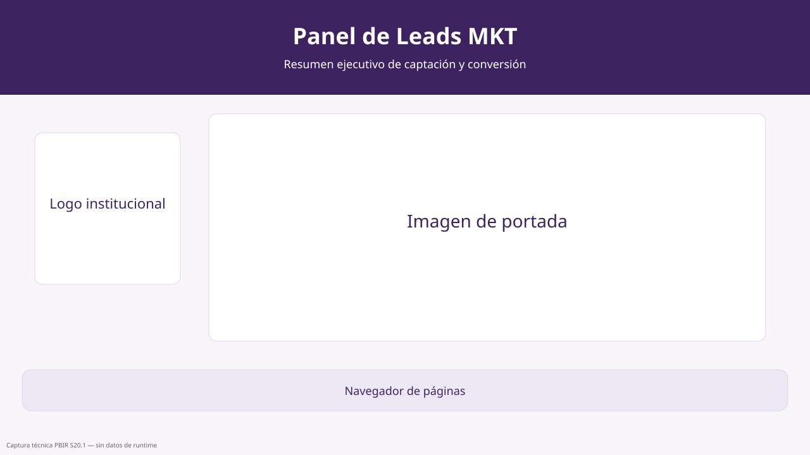

### Navegador de páginas

- **Tipo:** Navegador de páginas.
- **Qué muestra:** accesos a los módulos funcionales del reporte.
- **Cómo usarlo:** seleccione la sección que desea consultar. Desde cualquier página funcional use **Inicio** para regresar a esta portada.

---

# 3. 🏛 Panel Ejecutivo

**Objetivo:** ofrecer una lectura consolidada de volumen, gestión, conversión y oportunidades.

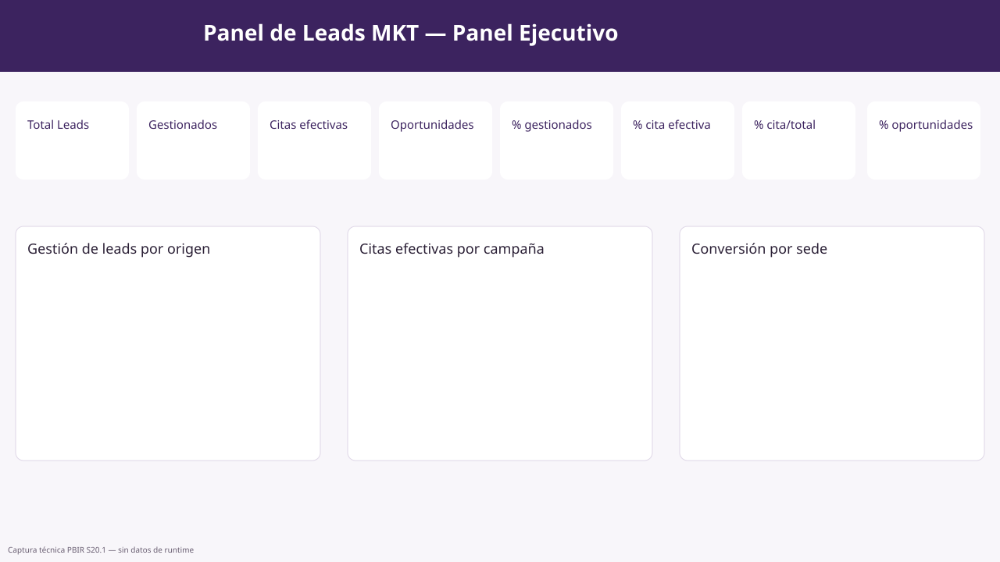

## KPIs

| Visual | Qué muestra | Cómo interpretarlo |
|---|---|---|
| 👥 Total Leads | Universo total bajo los filtros activos. | Es el punto de partida del análisis. |
| 🗂 Leads gestionados | Leads considerados gestionados por la lógica aprobada. | Compare con Total Leads para medir cobertura de gestión. |
| 📅 Citas efectivas | Leads cuyo estado actual es `Cita efectiva`. | Representa el resultado comercial principal del funnel. |
| 🏆 Oportunidades ganadas | Oportunidades ganadas disponibles en el modelo. | Úselo como indicador complementario; no crea una etapa adicional del funnel. |
| 🕒 % gestionados | Participación de gestionados sobre el universo correspondiente. | Mide cobertura de gestión. |
| % cita efectiva | Conversión desde gestionados hacia cita efectiva. | Indicador de eficiencia comercial. |
| % cita efectiva / total | Citas efectivas sobre Total Leads. | Permite comparar conversión global contra conversión sobre gestionados. |
| % oportunidades ganadas | Participación de oportunidades ganadas sobre el universo de oportunidades. | Úselo como métrica complementaria. |

## Gráficos

| Visual | Lectura recomendada |
|---|---|
| Gestión de leads por origen | Identifique orígenes con mayor cobertura de gestión y aquellos que requieren seguimiento. |
| Citas efectivas por campaña | Detecte campañas que concentran mayor participación de citas efectivas. |
| Conversión a cita efectiva por sede | Compare eficiencia comercial entre sedes. |
| Citas efectivas por carrera | Identifique carreras que concentran resultados efectivos. |
| Conversión a cita efectiva por modalidad | Compare eficiencia por modalidad académica. |
| Conversión a cita efectiva por origen | Detecte orígenes que convierten mejor a cita efectiva. |

## Filtros

- **Origen**: restringe el análisis por fuente/origen del Lead.
- **Campaña**: filtra por campaña CRM.
- **Carrera**: usa `DimCarrera`.
- **Sede**: usa `DimSede`.
- **Modalidad**: usa `DimModalidad`.
- **Rango global de fecha**: filtra por `Candidato[CreatedDate]`.

---

# 4. ⭐ Prioridades comerciales

**Objetivo:** responder qué atender primero y dónde reforzar el seguimiento.

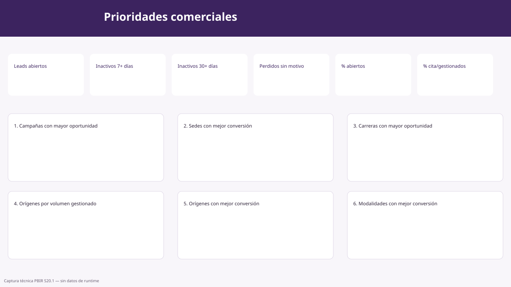

## KPIs

| Visual | Qué muestra | Acción sugerida |
|---|---|---|
| Leads abiertos | Gestionados que todavía no son cita efectiva. | Priorizar seguimiento según volumen y antigüedad. |
| % abiertos | Participación de abiertos en el contexto actual. | Comparar entre sedes/campañas. |
| Inactivos 7+ días | Leads gestionados sin actividad reciente. | Generar acción comercial temprana. |
| % inactivos 7+ días | Peso relativo del backlog de 7 días. | Detectar deterioro operativo. |
| Inactivos 30+ días | Leads con inactividad prolongada. | Prioridad alta de recuperación o cierre. |
| Perdidos sin motivo | Leads perdidos sin razón registrada. | Corregir calidad de gestión y registro. |
| % perdidos sin motivo | Proporción de pérdidas sin explicación. | Supervisar disciplina de captura. |
| % cita efectiva / gestionados | Conversión comercial del segmento seleccionado. | Identificar segmentos de mejor/peor desempeño. |

## Rankings priorizados

1. **Campañas con mayor oportunidad comercial**: muestra dónde existe mayor participación de resultados efectivos.
2. **Sedes con mejor conversión comercial**: compara conversión entre sedes.
3. **Carreras con mayor oportunidad comercial**: identifica carreras con mayor participación de citas efectivas.
4. **Orígenes a priorizar por volumen gestionado**: detecta fuentes con alto volumen operativo.
5. **Orígenes con mejor conversión a cita efectiva**: ayuda a distinguir volumen de eficiencia.
6. **Modalidades con mejor conversión comercial**: compara modalidades.

Use los filtros de Carrera, Origen, Sede, Campaña, Modalidad y Fecha para transformar esta página en una lista de prioridades específica.

---

# 5. 👥 Leads

**Objetivo:** analizar el universo general de Leads, su estado, origen y evolución.

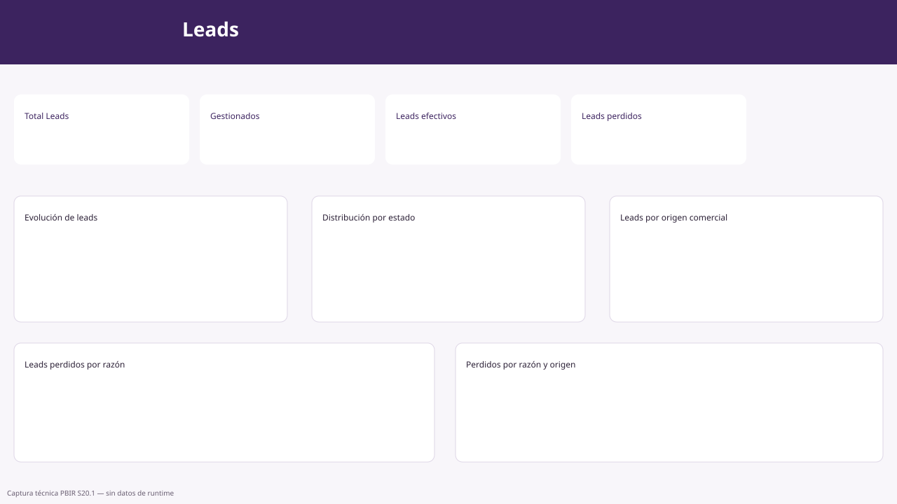

## KPIs

- **👥 Total Leads:** tamaño del universo.
- **🗂 Leads gestionados:** volumen gestionado.
- **📅 Leads efectivos:** volumen de citas efectivas.
- **⚠️ Leads perdidos:** volumen de pérdidas.

## Visuales

| Visual | Uso |
|---|---|
| Evolución de leads | Analice tendencia de creación de Leads a lo largo del tiempo. |
| 📊 Distribución de Leads por estado | Compare el peso de cada estado CRM. |
| 📍 Leads por origen comercial | Identifique las fuentes que generan mayor volumen. |
| 🚫 Leads perdidos por razón | Detecte causas principales de pérdida. |
| 🚫 Perdidos por razón y origen | Cruce causa de pérdida con fuente comercial. |

## Filtros

Periodo, Carrera, Fecha, Campaña, Estado, Origen y rango global de fecha.

---

# 6. 🚫 Leads Perdidos

**Objetivo:** diagnosticar las pérdidas y localizar sus causas y concentraciones.

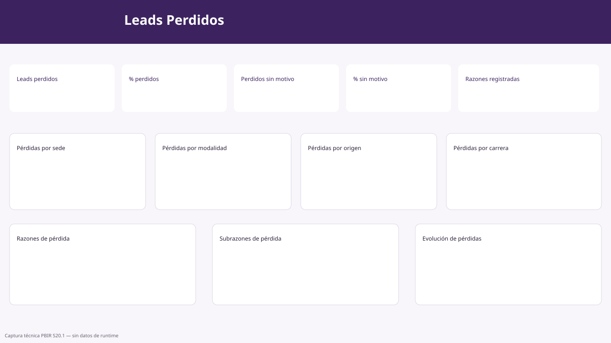

## KPIs

- **⚠️ Leads perdidos:** total actual de perdidos.
- **% perdidos:** proporción de pérdidas sobre el universo correspondiente.
- **Perdidos sin motivo:** perdidos sin razón registrada.
- **% perdidos sin motivo:** indicador de calidad de registro.
- **Razones de pérdida registradas:** cantidad de categorías de pérdida observadas.

## Visuales

| Visual | Qué permite responder |
|---|---|
| Leads perdidos por sede | ¿En qué sedes se concentra la pérdida? |
| Leads perdidos por modalidad | ¿Qué modalidades concentran más pérdidas? |
| Leads perdidos por origen | ¿Qué fuentes producen mayor pérdida? |
| Leads perdidos por carrera | ¿Qué carreras concentran pérdidas? |
| 🚫 Leads perdidos por razón | ¿Cuáles son las causas principales? |
| 🚫 Principales subrazones de pérdida | ¿Qué detalle explica mejor cada causa? |
| Evolución de leads perdidos | ¿La pérdida aumenta, disminuye o presenta picos? |

Filtros disponibles: Origen, Modalidad, Sede, Fecha, Carrera y rango global de fecha.

---

# 7. 🔻 Funnel y conversión

**Objetivo:** controlar el funnel aprobado y comparar tasas de conversión.

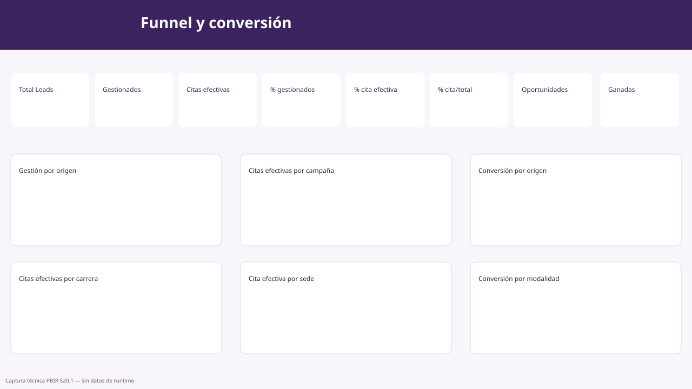

## Funnel aprobado

`Total Leads → Leads Gestionados → Cita Efectiva`

No deben interpretarse las oportunidades como una etapa adicional automática del funnel.

## KPIs

- **👥 Total Leads**.
- **🗂 Leads gestionados**.
- **📅 Citas efectivas**.
- **% gestionados**.
- **% cita efectiva**: conversión sobre gestionados.
- **🎯 % cita efectiva sobre total**: conversión sobre Total Leads.
- **🌐 Oportunidades globales**.
- **🏆 Oportunidades ganadas**.
- **% oportunidades ganadas**.

## Gráficos

- **Gestión de leads por origen**: cobertura operativa por fuente.
- **Citas efectivas por campaña**: participación de resultados por campaña.
- **Conversión a cita efectiva por origen**: eficiencia por fuente.
- **Citas efectivas por carrera**: distribución de resultados por carrera.
- **Cita efectiva sobre el total por sede**: compara resultado final frente al universo captado.
- **Conversión a cita efectiva por modalidad**: eficiencia por modalidad.

---

# 8. 🕘 Historial de leads

**Objetivo:** analizar cambios registrados en el historial sin inferir estados históricos inexistentes.

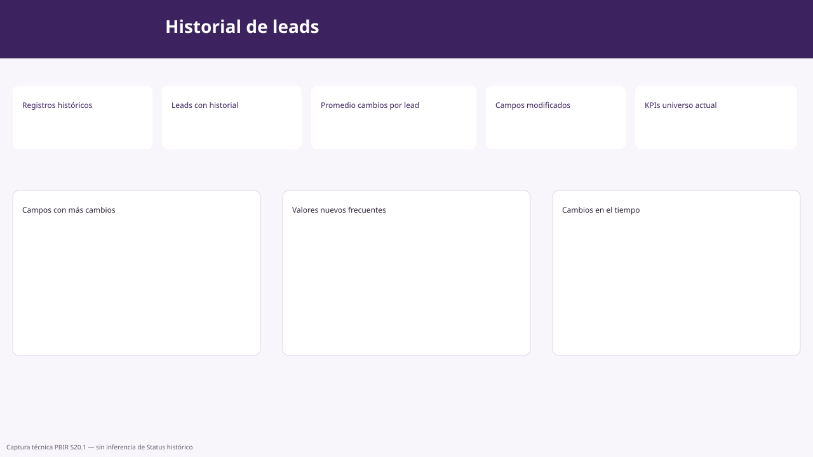

## KPIs históricos válidos

| KPI | Significado |
|---|---|
| 🕘 Registros históricos | Total de eventos/cambios registrados. |
| 🧾 Leads con historial | Leads que cuentan con al menos un registro histórico. |
| Promedio de cambios por lead | Intensidad promedio de cambios por Lead. |
| 🗂 Campos modificados | Cantidad de campos distintos modificados. |

## KPIs de universo actual

- **Cita efectiva (universo actual)**.
- **% cita efectiva (universo actual)**.
- **Perdidos (universo actual)**.
- **% perdidos (universo actual)**.

Estos KPIs representan el estado actual del Lead y no el estado histórico de cada evento.

## Visuales

- **Cambios del historial en el tiempo**: tendencia de eventos históricos.
- **Campos con más cambios registrados**: campos que concentran mayor actividad de modificación.
- **Valores nuevos más frecuentes**: valores que aparecen con mayor frecuencia en `NewValue`.

## Filtros

Campo modificado, Valor anterior, Valor nuevo, Fecha y rango global de creación del Lead.

> Regla crítica: no se infiere `Status = Perdido` o `Cita efectiva` desde `NewValue` porque la tabla histórica no garantiza un historial de Status completo.

---

# 9. ⏳ Cohortes e inactividad

**Objetivo:** medir backlog, Leads abiertos, inactividad y envejecimiento.

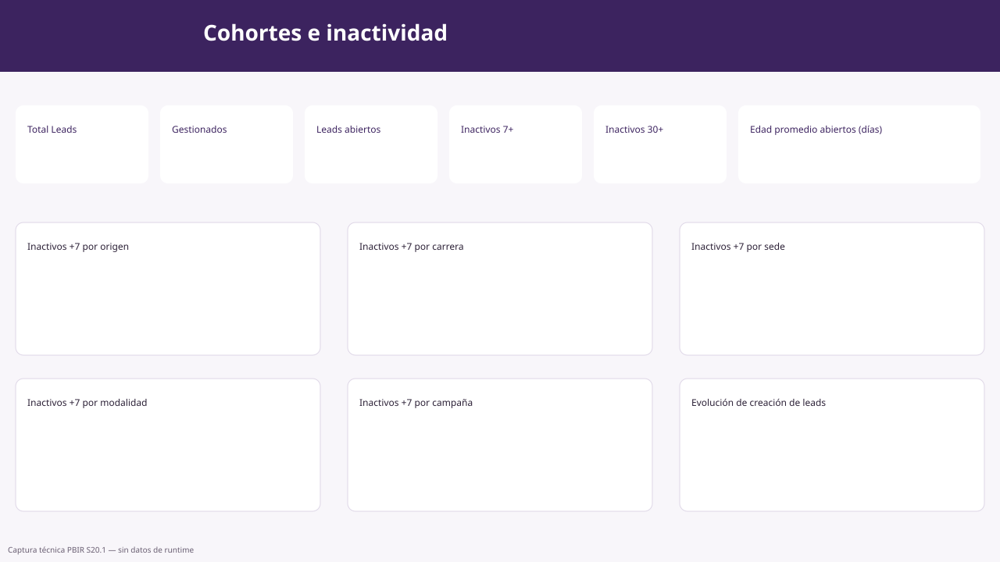

## KPIs

- **👥 Total Leads**.
- **🗂 Leads gestionados**.
- **✉️ Leads abiertos**.
- **% abiertos**.
- **Sin actividad ≥ 7 días** y **% inactivos 7+ días**.
- **Sin actividad ≥ 30 días** y **% inactivos 30+ días**.
- **Edad promedio de leads abiertos (días)**.

## Visuales

| Visual | Uso |
|---|---|
| Leads inactivos (+7 días) por origen | Localizar backlog por fuente. |
| Leads inactivos (+30 días) por origen | Identificar backlog crítico. |
| Leads inactivos (+7 días) por carrera | Priorizar seguimiento por demanda académica. |
| Leads inactivos (+7 días) por modalidad | Comparar modalidad. |
| Leads inactivos (+7 días) por campaña | Detectar campañas con acumulación. |
| Leads inactivos (+7 días) por sede | Localizar presión operativa por sede. |
| Evolución de creación de leads | Relacionar crecimiento del volumen con el backlog. |

---

# 10. 🎯 Eficiencia de captación

**Objetivo:** evaluar la calidad y eficiencia de la captación comercial.

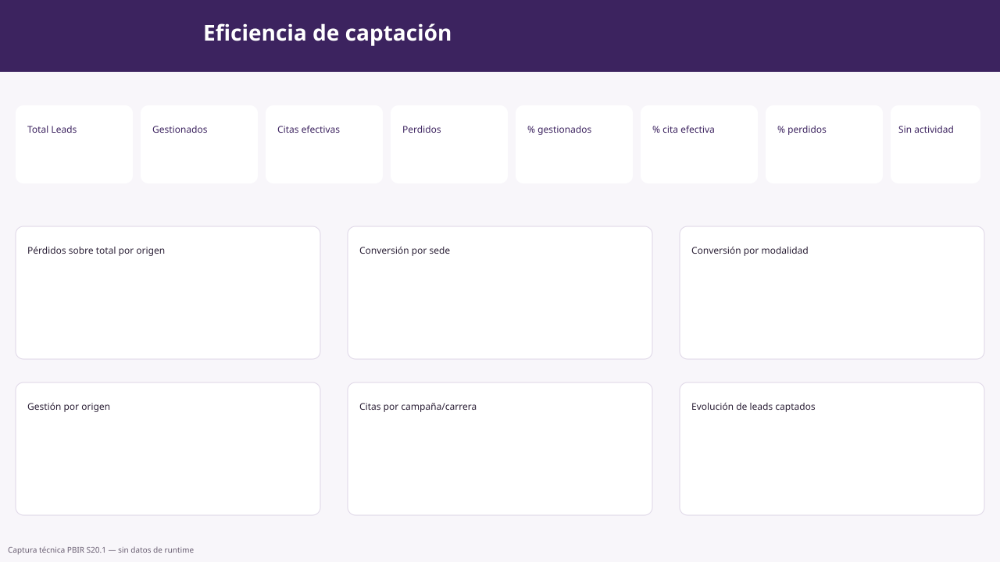

## KPIs

- Total Leads.
- Leads gestionados.
- Citas efectivas.
- Leads perdidos.
- % gestionados.
- % cita efectiva.
- % perdidos.
- Leads sin actividad registrada.
- % sin actividad registrada.

## Visuales

- **Pérdidos sobre el total por origen**: mide calidad relativa de cada fuente.
- **Gestión de leads por origen**: compara cobertura operativa.
- **Conversión a cita efectiva por sede** y **por modalidad**: detecta eficiencia comercial.
- **Citas efectivas por campaña** y **por carrera**: identifica concentración de resultados.
- **Evolución de leads captados**: permite identificar cambios de tendencia.

---

# 11. 📈 Desempeño comercial

**Objetivo:** comparar volumen, gestión, conversión y pérdidas entre segmentos.

## KPIs

Total Leads, Leads gestionados, Citas efectivas, Leads perdidos, Leads abiertos, % gestionados, % cita efectiva y % perdidos.

## Visuales

| Visual | Lectura |
|---|---|
| Evolución del volumen de leads | Tendencia del universo captado. |
| Conversión a cita efectiva por modalidad | Eficiencia por modalidad. |
| Conversión a cita efectiva por sede | Eficiencia por sede. |
| Citas efectivas por campaña | Concentración de resultados por campaña. |
| Citas efectivas por carrera | Concentración de resultados por carrera. |
| Leads perdidos por origen | Calidad de las fuentes. |
| Gestión de leads por origen | Cobertura de seguimiento comercial. |

---

# 12. 🎓 Demanda académica

**Objetivo:** comprender qué oferta académica concentra demanda y resultados.

## KPIs

Total Leads, Leads gestionados, Citas efectivas, Leads perdidos, Leads abiertos, % gestionados, % cita efectiva y % perdidos.

## Visuales

- **Demanda por carrera**: distribución de Leads por carrera.
- **Demanda por modalidad**: distribución por modalidad.
- **Demanda por período académico**: distribución por período CRM.
- **Conversión a cita efectiva por sede**: compara resultado por sede.
- **Citas efectivas por carrera**: identifica carreras con mayor resultado efectivo.
- **Leads perdidos por carrera**: localiza carreras con mayor pérdida.
- **Evolución del volumen de leads**: tendencia de demanda.

Filtros: Periodo, Sede, Carrera, Origen, Modalidad y rango global de fecha.

---

# 13. 🚨 Alertas e Insights

**Objetivo:** transformar backlog y anomalías de gestión en una lista de atención.

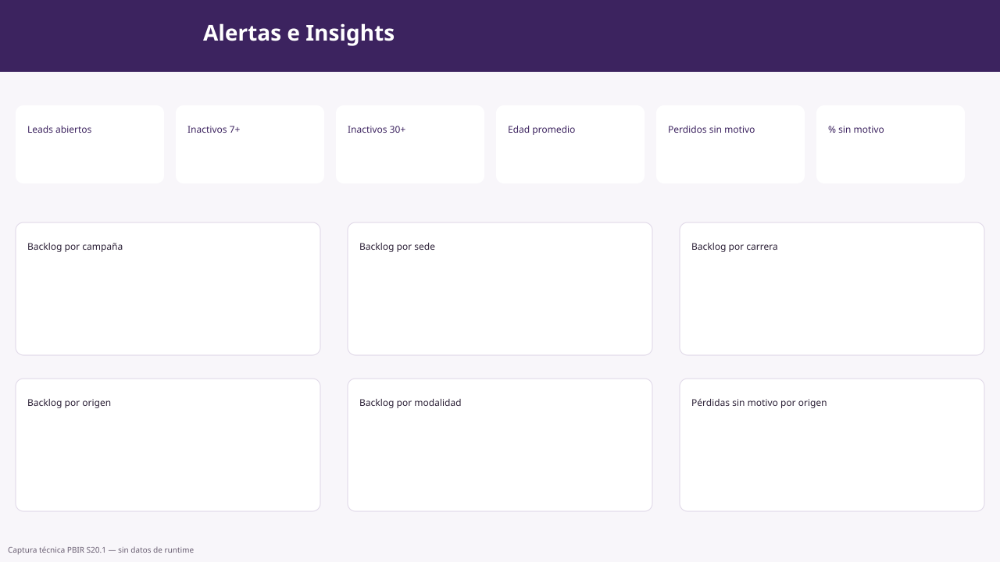

## KPIs

- **✉️ Leads abiertos**.
- **⏳ Inactivos 7+ días**.
- **⏳ Inactivos 30+ días**.
- **🕒 Edad promedio abiertos (días)**.
- **⚠️ Perdidos sin motivo**.
- **⚠️ % perdidos sin motivo**.

## Visuales de backlog

- Backlog inactivo (+7 días) por campaña.
- Backlog inactivo (+7 días) por sede.
- Backlog inactivo (+7 días) por carrera.
- Backlog inactivo (+7 días) por origen.
- Backlog inactivo (+7 días) por modalidad.
- Pérdidas sin motivo por origen.
- Evolución del volumen de leads.

**Uso recomendado:** empiece por el KPI de inactividad, identifique el segmento dominante en los rankings y luego vaya a **Explorador de Leads** para localizar registros concretos.

---

# 14. 🔎 Explorador de Leads

**Objetivo:** pasar del análisis agregado al detalle operativo.

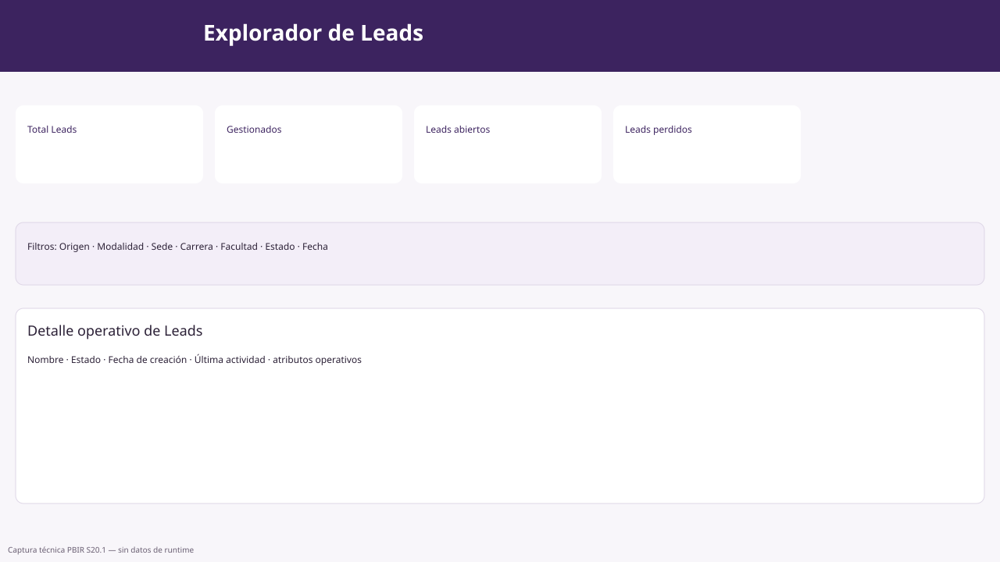

## KPIs

Total Leads, Leads gestionados, Leads abiertos y Leads perdidos.

## Filtros

Origen, Modalidad, Sede, Carrera, Facultad, Estado y rango global de fecha.

## Detalle operativo de Leads

La tabla incluye, entre otros, los siguientes atributos del registro:

- Nombre del Lead.
- Estado.
- Fecha de creación.
- Fecha de última actividad.
- Otros campos operativos configurados en PBIR.

**Cómo usarla:** reduzca primero el universo mediante filtros y luego revise los registros individuales. Evite exportar o compartir información personal fuera de los canales autorizados.

---

# 15. 🧹 Calidad de Datos

**Objetivo:** identificar campos faltantes y problemas de cobertura semántica.

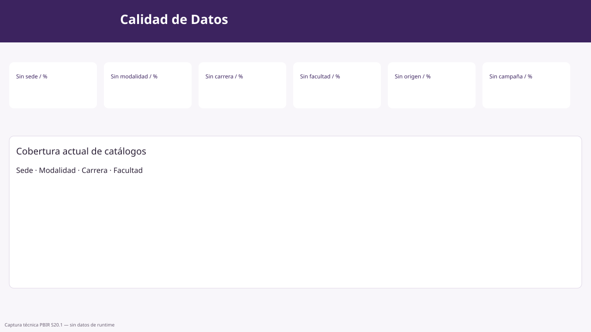

## KPIs de completitud

| KPI absoluto | KPI porcentual |
|---|---|
| Leads sin sede | % sin sede |
| Leads sin modalidad | % sin modalidad |
| Leads sin carrera | % sin carrera |
| Leads sin facultad | % sin facultad |
| Leads sin origen | % sin origen |
| Leads sin campaña | % sin campaña |

## Cobertura actual de catálogos

Tabla de control para revisar la disponibilidad de valores en las dimensiones de Sede, Modalidad, Carrera y Facultad.

**Uso recomendado:** priorice primero los campos que afectan segmentación, atribución comercial y análisis académico. No invente equivalencias para códigos CRM; cualquier mapping debe provenir de un catálogo validado.

---

# 16. 🎯 Mix Académico

**Objetivo:** visualizar la composición del universo por estructura académica y territorial.

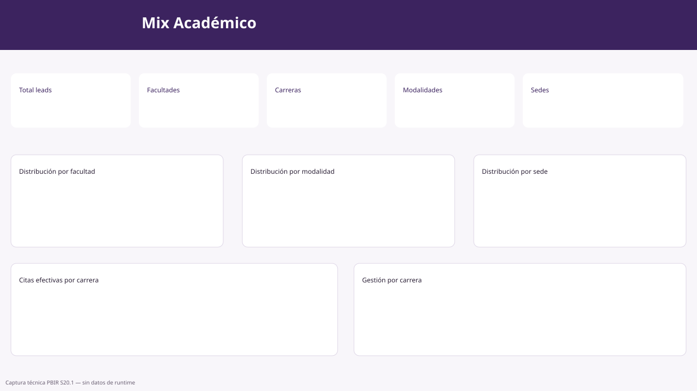

## KPIs

- **Total leads**.
- **Facultades**.
- **Carreras**.
- **Sedes**.
- **Modalidades**.

## Visuales

| Visual | Interpretación |
|---|---|
| Distribución de leads por facultad | Peso de cada facultad en la demanda. |
| Distribución de leads por sede | Composición territorial. |
| Distribución de leads por modalidad | Preferencia por modalidad. |
| Gestión por carrera | Volumen gestionado en cada carrera. |
| Citas efectivas por carrera | Resultado efectivo por carrera. |

---

# 17. Glosario de KPIs

| KPI | Interpretación funcional |
|---|---|
| Total Leads | Universo de Leads bajo los filtros activos. |
| Leads Gestionados | Leads considerados gestionados según la semántica aprobada del modelo. |
| Citas efectivas / Leads Efectivos | Leads cuyo estado actual corresponde a `Cita efectiva`. |
| Leads Perdidos | Leads cuyo estado actual corresponde a `Perdido`. |
| Leads Abiertos | `MAX(0, Leads Gestionados - Leads Efectivos)`. |
| % Gestionados | Participación de gestionados sobre el universo correspondiente. |
| % Cita Efectiva | Tasa de cita efectiva; revise el título para saber si el denominador es Total o Gestionados. |
| Inactivos 7+/30+ días | Leads gestionados sin actividad dentro del umbral definido. |
| Perdidos sin motivo | Leads perdidos sin razón de pérdida registrada. |
| Oportunidades globales / ganadas | Métricas complementarias de Opportunity; no constituyen etapas adicionales del funnel. |

# 18. Preguntas frecuentes

**¿Por qué un gráfico cambia cuando hago clic en otro?**  
Power BI aplica selección cruzada entre visuales compatibles. Limpie la selección para volver al contexto general.

**¿Por qué dos porcentajes de cita efectiva pueden ser distintos?**  
Porque uno puede usar Total Leads como denominador y otro Leads Gestionados.

**¿El historial permite saber cuándo un Lead cambió a Perdido o Cita efectiva?**  
No de forma confiable con la estructura disponible. La página histórica mide cambios registrados y campos modificados; no infiere `Status` histórico desde `NewValue`.

**¿Qué hago si los datos parecen desactualizados?**  
Revise la hora del último refresh y el historial de actualización del modelo semántico en Power BI Service.

**¿Qué debo hacer ante un Lead sin sede/carrera/modalidad?**  
Revise Calidad de Datos y corrija el dato en el sistema fuente o mediante un catálogo validado; no cree mappings arbitrarios dentro del reporte.
